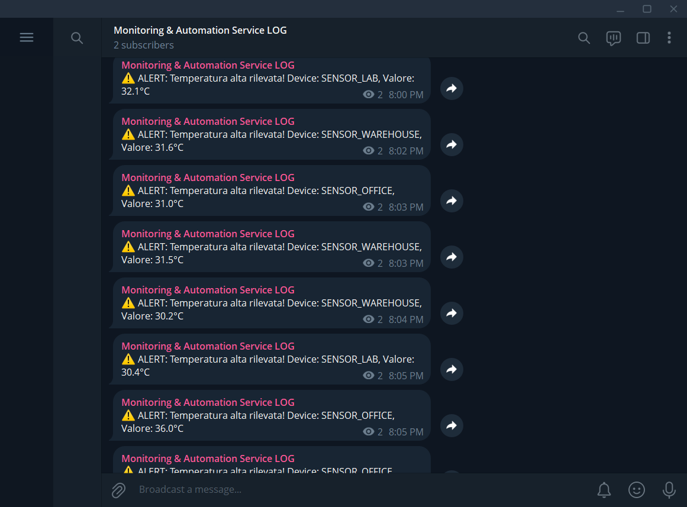

# Monitoring & Automation Demo

This is a demonstration project that combines **Automation**, **Backend API**, and a **Web Dashboard**.
It is designed to showcase skills in:
1.  **Python Scripting & Automation** (sensor simulation, automated notifications).
2.  **Backend Web Development** (FastAPI, Database).
3.  **Data Integration/IoT** (real-time data flow).

## 📸 Preview

### 🎥 Dashboard & System Demo

<video src="MediaPreview/VideoPreview.mp4" controls title="System Demo" width="100%"></video>

### 🔔 Telegram Notifications


## 📂 Structure
- `backend/`: The system's core. FastAPI app that receives data and serves the dashboard.
- `data_producer/`: Python script that simulates IoT sensors sending data to the backend.
- `frontend/`: Minimal dashboard in HTML/Bootstrap (no build required).
- `notifier/`: Module that analyzes data and handles alerts (e.g., Telegram/Email).

## 🚀 How to Run (Windows)

### 1. Prerequisites
Ensure you have Python installed.

### 2. Configuration (.env)
Create a `.env` file in the root directory (optional but recommended for notifications):
```ini
TELEGRAM_BOT_TOKEN=your_token_here
TELEGRAM_CHAT_ID=your_chat_id_here
ALERT_THRESHOLD=30.0
```

### 3. Installation
Open a terminal in the project folder:
```bash
pip install -r requirements.txt
```

### 4. Start the Server (Backend + Dashboard)
In a terminal:
```bash
uvicorn backend.main:app --reload
```
The dashboard will be available at: [http://localhost:8000](http://localhost:8000)

### 5. Start the Data Simulator
Open a **second terminal**:
```bash
python data_producer/simulator.py
```
You will see data flowing in the terminal and appearing automatically on the web dashboard.

## 🛠 Demo Features
- **REST API**: `POST /api/data` to receive data, `GET /api/data` to read it.
- **Automation**: If the temperature exceeds **30°C** (configurable), the system triggers an alert (logs to console or sends a Telegram message if configured).
- **Database**: Uses SQLite (`monitor.db` created automatically) for simplicity.
